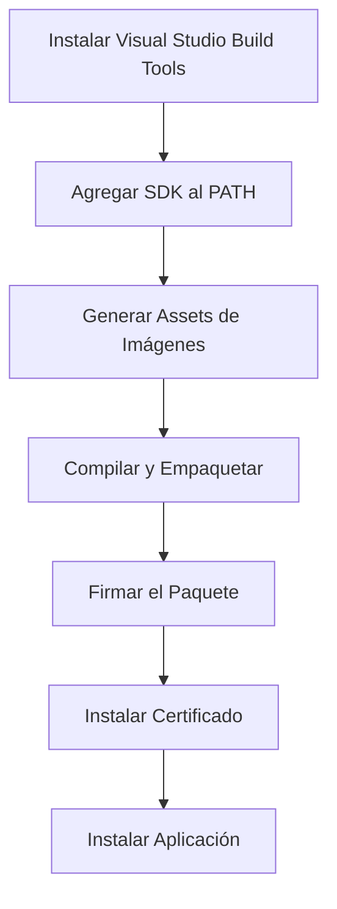

# Guía Completa de Certificación y Scripts de WinTTS

## 📋 Tabla de Contenidos

1. [Introducción a la Certificación MSIX](#introducción-a-la-certificación-msix)
2. [Scripts Disponibles](#scripts-disponibles)
3. [Proceso Completo de Empaquetado](#proceso-completo-de-empaquetado)
4. [Certificados y Seguridad](#certificados-y-seguridad)
5. [Solución de Problemas](#solución-de-problemas)

---

## Introducción a la Certificación MSIX

### ¿Qué es un paquete MSIX?

MSIX es el formato moderno de empaquetado de aplicaciones de Windows que reemplaza a los instaladores tradicionales (.exe, .msi). Ofrece:

- ✅ Instalación y desinstalación limpia
- ✅ Actualizaciones automáticas
- ✅ Aislamiento de la aplicación (sandbox)
- ✅ Distribución a través de Microsoft Store
- ✅ Firma digital para seguridad

### ¿Por qué necesita estar firmado?

Windows **requiere** que todos los paquetes MSIX estén firmados digitalmente para:

1. **Verificar la identidad del desarrollador**: Garantiza que el paquete proviene de una fuente confiable
2. **Integridad del paquete**: Asegura que el paquete no ha sido modificado después de la firma
3. **Seguridad del sistema**: Protege a los usuarios de software malicioso

### Tipos de Certificados

#### 1. Certificado de Desarrollo (Autofirmado)
- **Uso**: Pruebas locales en tu PC
- **Costo**: Gratis
- **Confianza**: Solo en tu PC (después de instalarlo manualmente)
- **Archivo**: `WinTTS_Dev_Certificate.pfx`

#### 2. Certificado de Microsoft Store
- **Uso**: Distribución pública a través de la Store
- **Costo**: Incluido con la cuenta de desarrollador ($19 USD/año)
- **Confianza**: Automática en todos los PCs con Windows
- **Proceso**: Microsoft firma automáticamente tu paquete

---

## Scripts Disponibles

### 1. `generate-assets.ps1`

**Propósito**: Genera automáticamente los assets de imágenes PNG requeridos por el paquete MSIX.

**Qué hace**:
1. Lee el archivo `Icon/app_icon.ico`
2. Convierte el ícono a diferentes tamaños PNG
3. Guarda las imágenes en la carpeta `Image/`

**Assets generados**:
- `Square44x44Logo.png` (44×44 px) - Ícono pequeño en la barra de tareas
- `Square150x150Logo.png` (150×150 px) - Ícono del menú Inicio
- `Wide310x150Logo.png` (310×150 px) - Tile ancho del menú Inicio
- `StoreLogo.png` (50×50 px) - Logo para la Microsoft Store

**Uso**:
```powershell
.\scripts\generate-assets.ps1
```

**Cuándo usarlo**:
- La primera vez que empaquetas la aplicación
- Cuando actualizas el ícono de la aplicación
- Si la carpeta `Image/` está vacía

**Tecnología utilizada**:
- `System.Drawing` de .NET para manipulación de imágenes
- Conversión de ICO a PNG con alta calidad (interpolación bicúbica)

---

### 2. `build-msix.ps1`

**Propósito**: Script maestro que compila el proyecto y genera el paquete MSIX completo.

**Qué hace (paso a paso)**:

#### [1/6] Verificar herramientas
- Busca `MSBuild` usando `vswhere.exe`
- Busca `makeappx.exe` y `signtool.exe` en el Windows SDK
- Valida que todas las herramientas estén disponibles

#### [2/6] Limpiar compilaciones anteriores
- Elimina las carpetas `bin/` y `obj/`
- Asegura una compilación limpia sin archivos antiguos

#### [3/6] Compilar el proyecto
- Ejecuta `msbuild` con configuración Release
- Compila el proyecto C# WPF
- Genera el ejecutable `WinTTS.exe`

#### [4/6] Preparar archivos para el paquete
- Crea la carpeta `publish/msix/package/`
- Copia todos los archivos compilados (DLLs, EXE, etc.)
- Copia el manifest y lo actualiza:
  - Reemplaza `$targetnametoken$` con `WinTTS`
  - Guarda como `AppxManifest.xml`
- Copia la carpeta `Image/` con los logos

#### [5/6] Generar el paquete MSIX
- Ejecuta `makeappx.exe pack`
- Crea el archivo `WinTTS.msix` (sin firmar)
- Tamaño aproximado: ~0.60 MB

#### [6/6] Firmar el paquete (opcional)
- Busca el certificado `WinTTS_Certificate.pfx`
- Si existe, firma el paquete con `signtool.exe`
- Si no existe, muestra advertencia

**Uso**:
```powershell
# Uso básico
.\scripts\build-msix.ps1

# Con parámetros personalizados
.\scripts\build-msix.ps1 -Configuration Release -Platform x64 -SdkVersion "10.0.26100.0"
```

**Parámetros**:
- `-Configuration`: Debug o Release (default: Release)
- `-Platform`: x64, x86, AnyCPU (default: x64)
- `-SdkVersion`: Versión del SDK a usar (default: 10.0.26100.0)

**Salida**:
- `publish/msix/WinTTS.msix` - Paquete MSIX
- `publish/msix/package/` - Archivos desempaquetados (para debug)

**Cuándo usarlo**:
- Cada vez que quieras generar una nueva versión del paquete
- Después de hacer cambios en el código
- Antes de publicar en la Store

---

### 3. `sign-package.ps1`

**Propósito**: Crea un certificado de desarrollo y firma el paquete MSIX (sin permisos de admin).

**Qué hace (paso a paso)**:

#### [1/2] Crear certificado de desarrollo
1. Busca si existe `WinTTS_Dev_Certificate.pfx` y lo elimina
2. Crea un certificado autofirmado con:
   - **Subject**: `CN=biglexj`
   - **KeyUsage**: DigitalSignature
   - **Ubicación**: `Cert:\CurrentUser\My` (almacén del usuario)
   - **Validez**: 1 año (por defecto)
3. Exporta el certificado a `WinTTS_Dev_Certificate.pfx`
4. Contraseña: vacía (para facilitar el desarrollo)

#### [2/2] Firmar el paquete MSIX
1. Busca el paquete en `publish/msix/WinTTS.msix`
2. Ejecuta `signtool.exe sign` con:
   - Algoritmo: SHA256
   - Certificado: `WinTTS_Dev_Certificate.pfx`
   - Modo: Firma automática (`/a`)
3. Verifica que la firma sea exitosa

**Uso**:
```powershell
# Uso básico (Publisher por defecto: CN=biglexj)
.\scripts\sign-package.ps1

# Con Publisher personalizado
.\scripts\sign-package.ps1 -Publisher "CN=MiNombre"

# Con contraseña para el certificado
.\scripts\sign-package.ps1 -Password "MiPassword123"
```

**Parámetros**:
- `-Publisher`: Nombre del publisher (default: `CN=biglexj`)
- `-Password`: Contraseña para el certificado PFX (default: vacío)

**Importante**:
- ⚠️ Este script NO requiere permisos de administrador
- ⚠️ El certificado se crea en el almacén del usuario, no del sistema
- ⚠️ Después de firmar, necesitas instalar el certificado con `install-dev-cert.ps1`

**Cuándo usarlo**:
- Después de ejecutar `build-msix.ps1`
- Cuando el paquete no está firmado
- Si cambiaste el Publisher en el manifest

---

### 4. `install-dev-cert.ps1`

**Propósito**: Instala el certificado de desarrollo en el almacén de confianza del sistema.

**Qué hace**:

1. **Verifica permisos de administrador**
   - Este script SÍ requiere permisos de admin
   - Si no los tiene, muestra instrucciones

2. **Busca el certificado**
   - Busca `WinTTS_Dev_Certificate.pfx` en la raíz del proyecto
   - Valida que exista

3. **Importa el certificado**
   - Importa a `Cert:\LocalMachine\Root`
   - Esto es el almacén "Entidades de certificación raíz de confianza"
   - Hace que Windows confíe en el certificado

**Uso**:
```powershell
# Opción 1: PowerShell como Administrador
.\scripts\install-dev-cert.ps1

# Opción 2: Con sudo (si lo tienes configurado)
sudo pwsh -File .\scripts\install-dev-cert.ps1
```

**¿Por qué requiere admin?**
- Modificar el almacén `LocalMachine\Root` requiere permisos elevados
- Es una medida de seguridad de Windows
- Solo los administradores pueden agregar certificados de confianza al sistema

**Cuándo usarlo**:
- Después de ejecutar `sign-package.ps1`
- Antes de instalar la aplicación con `Add-AppxPackage`
- Solo necesitas ejecutarlo UNA VEZ por certificado

**Alternativa manual**:
Si no puedes usar el script, instala manualmente:
1. Doble clic en `WinTTS_Dev_Certificate.pfx`
2. Selecciona "Equipo local" (requiere admin)
3. Deja la contraseña en blanco
4. Selecciona "Entidades de certificación raíz de confianza"
5. Finalizar

---

### 5. `create-and-sign.ps1`

**Propósito**: Script todo-en-uno que crea el certificado, firma el paquete E instala el certificado.

**Qué hace**:
- Combina las funciones de `sign-package.ps1` + `install-dev-cert.ps1`
- Requiere permisos de administrador desde el inicio
- Útil para automatización completa

**Uso**:
```powershell
# Con sudo
sudo pwsh -File .\scripts\create-and-sign.ps1

# O en PowerShell como Administrador
.\scripts\create-and-sign.ps1
```

**Cuándo usarlo**:
- Si prefieres un solo comando para todo
- En scripts de CI/CD
- Para configuración inicial rápida

**Nota**: Este script es más conveniente pero menos flexible que usar los scripts individuales.

---

### 6. `add-sdk-to-path.ps1`

**Propósito**: Agrega el Windows SDK al PATH del sistema de forma permanente.

**Qué hace**:

1. **Verifica permisos de administrador**
   - Requiere admin para modificar variables del sistema

2. **Busca el SDK**
   - Busca en `C:\Program Files (x86)\Windows Kits\10\bin\`
   - Detecta la versión instalada (10.0.26100.0 o 10.0.22621.0)

3. **Agrega al PATH**
   - Modifica la variable de entorno `Path` del sistema
   - Agrega la ruta del SDK (arquitectura x64)

4. **Verifica la instalación**
   - Confirma que la ruta se agregó correctamente

**Uso**:
```powershell
# Con sudo
sudo pwsh -File .\scripts\add-sdk-to-path.ps1

# Con parámetros personalizados
sudo pwsh -File .\scripts\add-sdk-to-path.ps1 -SdkVersion "10.0.22621.0" -Architecture "x86"
```

**Parámetros**:
- `-SdkVersion`: Versión del SDK (default: 10.0.26100.0)
- `-Architecture`: x64, x86, arm64 (default: x64)

**Cuándo usarlo**:
- Después de instalar Visual Studio Build Tools
- Si `makeappx.exe` no se reconoce en la terminal
- Solo necesitas ejecutarlo UNA VEZ

**Alternativa temporal**:
Si no quieres modificar el PATH del sistema, puedes agregarlo solo para la sesión actual:
```powershell
$env:Path += ';C:\Program Files (x86)\Windows Kits\10\bin\10.0.26100.0\x64'
```

---

## Proceso Completo de Empaquetado

### Flujo de Trabajo Completo (Primera Vez)



#### Paso 1: Configuración Inicial (solo una vez)

```powershell
# 1. Agregar SDK al PATH (requiere admin)
sudo pwsh -File .\scripts\add-sdk-to-path.ps1

# 2. Recargar el PATH en la sesión actual
$env:Path = [System.Environment]::GetEnvironmentVariable("Path","Machine") + ";" + [System.Environment]::GetEnvironmentVariable("Path","User")

# 3. Generar assets de imágenes
.\scripts\generate-assets.ps1
```

#### Paso 2: Compilar y Empaquetar

```powershell
# Compilar el proyecto y generar el paquete MSIX
.\scripts\build-msix.ps1
```

#### Paso 3: Firmar e Instalar Certificado

```powershell
# Opción A: Dos pasos (más control)
.\scripts\sign-package.ps1
sudo pwsh -File .\scripts\install-dev-cert.ps1

# Opción B: Un solo paso (más rápido)
sudo pwsh -File .\scripts\create-and-sign.ps1
```

#### Paso 4: Instalar la Aplicación

```powershell
# Instalar el paquete MSIX
Add-AppxPackage ".\publish\msix\WinTTS.msix"

# Verificar que se instaló
Get-AppxPackage *WinTTS*
```

### Flujo de Trabajo para Actualizaciones

Una vez configurado todo, para generar una nueva versión:

```powershell
# 1. Actualizar el número de versión en Package.appxmanifest
# Cambiar: <Identity Version="1.0.0.0" /> a <Identity Version="1.0.1.0" />

# 2. Compilar y empaquetar
.\scripts\build-msix.ps1

# 3. Firmar (el certificado ya está instalado)
.\scripts\sign-package.ps1

# 4. Desinstalar versión anterior
Get-AppxPackage *WinTTS* | Remove-AppxPackage

# 5. Instalar nueva versión
Add-AppxPackage ".\publish\msix\WinTTS.msix"
```

---

## Certificados y Seguridad

### Anatomía de un Certificado

Un certificado digital contiene:

1. **Subject (CN)**: Nombre del titular
   - Ejemplo: `CN=biglexj`
   - Debe coincidir con el Publisher en `Package.appxmanifest`

2. **Public Key**: Clave pública para verificar firmas
   - Algoritmo: RSA 2048 bits

3. **Private Key**: Clave privada para firmar (solo en el .pfx)
   - Se mantiene segura y nunca se comparte

4. **Validity Period**: Período de validez
   - Certificados autofirmados: 1 año por defecto
   - Certificados comerciales: 1-3 años

5. **Thumbprint**: Huella digital única
   - Hash SHA-1 del certificado
   - Ejemplo: `8C2031263B3225DA1A07E9ED994DA...`

### Diferencias entre Certificados

| Característica  | Desarrollo (Autofirmado) | Microsoft Store           |
| --------------- | ------------------------ | ------------------------- |
| **Costo**       | Gratis                   | Incluido con cuenta dev   |
| **Confianza**   | Solo tu PC               | Todos los PCs con Windows |
| **Instalación** | Manual (requiere admin)  | Automática                |
| **Validez**     | 1 año                    | Indefinida                |
| **Uso**         | Pruebas locales          | Distribución pública      |
| **Revocación**  | No disponible            | Sí, por Microsoft         |

### Cadena de Confianza

#### Certificado de Desarrollo:
```
WinTTS.msix (firmado)
    ↓
WinTTS_Dev_Certificate.pfx (autofirmado)
    ↓
Cert:\LocalMachine\Root (instalado manualmente)
    ↓
Windows confía ✅
```

#### Certificado de Microsoft Store:
```
WinTTS.msix (firmado por Microsoft)
    ↓
Microsoft Store Certificate
    ↓
Microsoft Root CA (preinstalado en Windows)
    ↓
Windows confía ✅ (automáticamente)
```

### Seguridad del Certificado

**Buenas prácticas**:

1. **No compartas el archivo .pfx**
   - Contiene la clave privada
   - Cualquiera con el .pfx puede firmar como tú

2. **Usa contraseñas en producción**
   - Para desarrollo local: contraseña vacía está bien
   - Para distribución: usa contraseña fuerte

3. **Guarda backups seguros**
   - Si pierdes el .pfx, no podrás actualizar la app
   - Guárdalo en un lugar seguro (no en el repositorio público)

4. **Rota certificados regularmente**
   - Los certificados autofirmados expiran
   - Crea uno nuevo antes de que expire el actual

5. **Para Microsoft Store**
   - No necesitas gestionar certificados
   - Microsoft se encarga de todo

---

## Solución de Problemas

### Error: "makeappx.exe no reconocido"

**Causa**: El Windows SDK no está en el PATH.

**Solución**:
```powershell
# Opción 1: Agregar permanentemente (requiere admin)
sudo pwsh -File .\scripts\add-sdk-to-path.ps1

# Opción 2: Agregar temporalmente (solo sesión actual)
$env:Path += ';C:\Program Files (x86)\Windows Kits\10\bin\10.0.26100.0\x64'
```

---

### Error: "Missing a required footprint file"

**Causa**: Faltan los assets de imágenes en la carpeta `Image/`.

**Solución**:
```powershell
.\scripts\generate-assets.ps1
```

---

### Error: "0x800B0109 - certificado raíz no compatible"

**Causa**: El certificado no está instalado en el almacén de confianza del sistema.

**Solución**:
```powershell
# Instalar el certificado (requiere admin)
sudo pwsh -File .\scripts\install-dev-cert.ps1
```

---

### Error: "0x80073CF6 - El paquete no se pudo registrar"

**Causa**: El idioma `x-generate` no es válido en el manifest.

**Solución**:
Edita `Package.appxmanifest` y cambia:
```xml
<!-- Antes -->
<Resource Language="x-generate"/>

<!-- Después -->
<Resource Language="es-ES"/>
```

Luego regenera el paquete:
```powershell
.\scripts\build-msix.ps1
.\scripts\sign-package.ps1
```

---

### Error: "Publisher mismatch"

**Causa**: El Publisher en el manifest no coincide con el del certificado.

**Solución**:
1. Verifica el Publisher en `Package.appxmanifest`:
   ```xml
   <Identity Publisher="CN=biglexj" />
   ```

2. Verifica el certificado:
   ```powershell
   Get-PfxCertificate .\WinTTS_Dev_Certificate.pfx | Select-Object Subject
   ```

3. Deben coincidir exactamente (incluyendo mayúsculas/minúsculas)

---

### Error: "Access denied" al instalar certificado

**Causa**: No tienes permisos de administrador.

**Solución**:
```powershell
# Usa sudo
sudo pwsh -File .\scripts\install-dev-cert.ps1

# O abre PowerShell como Administrador
# Win + X → "Terminal (Administrador)"
```

---

### El paquete se instala pero no aparece en el menú Inicio

**Causa**: Problema con los assets de imágenes o el manifest.

**Solución**:
1. Verifica que existan todos los assets:
   ```powershell
   Get-ChildItem .\Image\
   ```

2. Regenera los assets:
   ```powershell
   .\scripts\generate-assets.ps1
   ```

3. Recompila y reinstala:
   ```powershell
   .\scripts\build-msix.ps1
   .\scripts\sign-package.ps1
   Get-AppxPackage *WinTTS* | Remove-AppxPackage
   Add-AppxPackage ".\publish\msix\WinTTS.msix"
   ```

---

## Comandos Útiles

### Gestión de Paquetes MSIX

```powershell
# Listar aplicaciones instaladas
Get-AppxPackage *WinTTS*

# Desinstalar aplicación
Get-AppxPackage *WinTTS* | Remove-AppxPackage

# Ver detalles del paquete
Get-AppxPackage *WinTTS* | Format-List

# Ver logs de instalación
Get-AppPackageLog -ActivityID <ActivityID>
```

### Gestión de Certificados

```powershell
# Listar certificados en el almacén del usuario
Get-ChildItem Cert:\CurrentUser\My

# Listar certificados en el almacén del sistema
Get-ChildItem Cert:\LocalMachine\Root

# Buscar certificado específico
Get-ChildItem Cert:\LocalMachine\Root | Where-Object { $_.Subject -like "*biglexj*" }

# Ver detalles de un certificado
Get-PfxCertificate .\WinTTS_Dev_Certificate.pfx | Format-List

# Eliminar certificado del sistema (requiere admin)
Get-ChildItem Cert:\LocalMachine\Root | Where-Object { $_.Subject -eq "CN=biglexj" } | Remove-Item
```

### Verificación de Firma

```powershell
# Verificar si un paquete está firmado
Get-AuthenticodeSignature .\publish\msix\WinTTS.msix

# Ver detalles de la firma
Get-AuthenticodeSignature .\publish\msix\WinTTS.msix | Format-List
```

---

## Archivos Importantes del Proyecto

### Estructura de Directorios

```
WinTTS/
├── docs/
│   ├── MSIX_PACKAGING.md          # Guía de empaquetado
│   └── CERTIFICACION_Y_SCRIPTS.md # Este documento
├── scripts/
│   ├── generate-assets.ps1        # Genera imágenes PNG
│   ├── build-msix.ps1             # Compila y empaqueta
│   ├── sign-package.ps1           # Firma el paquete
│   ├── install-dev-cert.ps1       # Instala certificado
│   ├── create-and-sign.ps1        # Todo-en-uno
│   └── add-sdk-to-path.ps1        # Configura PATH
├── Image/                         # Assets de imágenes
│   ├── Square44x44Logo.png
│   ├── Square150x150Logo.png
│   ├── Wide310x150Logo.png
│   └── StoreLogo.png
├── Icon/
│   └── app_icon.ico               # Ícono fuente
├── publish/
│   └── msix/
│       ├── WinTTS.msix            # Paquete final
│       └── package/               # Archivos desempaquetados
├── Package.appxmanifest           # Configuración del paquete
├── WinTTS_Dev_Certificate.pfx     # Certificado de desarrollo
└── WinTTS.csproj                  # Proyecto C#
```

### Package.appxmanifest

Archivo de configuración principal del paquete MSIX:

```xml
<?xml version="1.0" encoding="utf-8"?>
<Package xmlns="http://schemas.microsoft.com/appx/manifest/foundation/windows10"
         xmlns:uap="http://schemas.microsoft.com/appx/manifest/uap/windows10"
         xmlns:rescap="http://schemas.microsoft.com/appx/manifest/foundation/windows10/restrictedcapabilities">

  <!-- Identidad del paquete -->
  <Identity
    Name="WinTTS.Project"              <!-- Nombre único del paquete -->
    Publisher="CN=biglexj"             <!-- Publisher (debe coincidir con el certificado) -->
    Version="1.0.0.0" />               <!-- Versión (incrementar en cada actualización) -->

  <!-- Propiedades de visualización -->
  <Properties>
    <DisplayName>WinTTS</DisplayName>                    <!-- Nombre mostrado al usuario -->
    <PublisherDisplayName>biglexj</PublisherDisplayName> <!-- Nombre del publisher mostrado -->
    <Logo>Image\StoreLogo.png</Logo>                     <!-- Logo para la Store -->
  </Properties>

  <!-- Requisitos del sistema -->
  <Dependencies>
    <TargetDeviceFamily 
      Name="Windows.Desktop"           <!-- Solo para Windows Desktop -->
      MinVersion="10.0.17763.0"        <!-- Windows 10 versión 1809 mínimo -->
      MaxVersionTested="10.0.19041.0"  <!-- Probado hasta Windows 10 versión 2004 -->
    />
  </Dependencies>

  <!-- Idiomas soportados -->
  <Resources>
    <Resource Language="es-ES"/>       <!-- Español (España) -->
  </Resources>

  <!-- Configuración de la aplicación -->
  <Applications>
    <Application 
      Id="App"
      Executable="WinTTS.exe"          <!-- Ejecutable principal -->
      EntryPoint="Windows.FullTrustApplication"> <!-- Aplicación de confianza total -->
      
      <uap:VisualElements
        DisplayName="WinTTS"
        Description="WinTTS Application"
        BackgroundColor="transparent"
        Square150x150Logo="Image\Square150x150Logo.png"
        Square44x44Logo="Image\Square44x44Logo.png">
        <uap:DefaultTile Wide310x150Logo="Image\Wide310x150Logo.png" />
      </uap:VisualElements>
    </Application>
  </Applications>

  <!-- Capacidades requeridas -->
  <Capabilities>
    <rescap:Capability Name="runFullTrust" /> <!-- Ejecutar con confianza total -->
  </Capabilities>
</Package>
```

**Campos importantes**:

- **Name**: Identificador único del paquete (no cambiar después de publicar)
- **Publisher**: Debe coincidir EXACTAMENTE con el Subject del certificado
- **Version**: Incrementar en cada actualización (formato: Major.Minor.Build.Revision)
- **MinVersion**: Versión mínima de Windows requerida
- **Language**: Código de idioma válido (ISO 639-1)

---

## Publicación en Microsoft Store

### Preparación del Paquete

1. **Reserva el nombre de la aplicación**:
   - Ve a [Microsoft Partner Center](https://partner.microsoft.com/dashboard)
   - Crea una nueva aplicación
   - Reserva el nombre "WinTTS"

2. **Actualiza el manifest con los valores de la Store**:
   
   Microsoft te proporcionará valores específicos:
   ```xml
   <Identity
     Name="12345biglexj.WinTTS"
     Publisher="CN=A1B2C3D4-E5F6-G7H8-I9J0-K1L2M3N4O5P6"
     Version="1.0.0.0" />
   ```

3. **Regenera el paquete**:
   ```powershell
   .\scripts\build-msix.ps1
   ```

4. **NO firmes el paquete**:
   - Microsoft lo firmará automáticamente
   - Sube el paquete sin firmar o firmado con tu certificado de desarrollo

### Proceso de Envío

1. **Sube el paquete MSIX**
2. **Completa la información**:
   - Descripción de la aplicación
   - Capturas de pantalla
   - Categoría
   - Clasificación por edades
   - Política de privacidad (si aplica)

3. **Envía para certificación**:
   - Proceso de revisión: 1-3 días hábiles
   - Microsoft verifica que cumple con las políticas

4. **Publicación**:
   - Una vez aprobado, se publica automáticamente
   - Los usuarios pueden instalarlo desde la Microsoft Store

---

## Mejores Prácticas

### Desarrollo

1. **Usa control de versiones**:
   - Incrementa la versión en cada build
   - Usa versionado semántico (Major.Minor.Patch)

2. **Mantén los certificados seguros**:
   - No los subas a repositorios públicos
   - Usa `.gitignore` para excluir `.pfx`

3. **Documenta los cambios**:
   - Mantén un `RELEASE_NOTES.md` actualizado
   - Documenta breaking changes

4. **Prueba antes de publicar**:
   - Instala localmente y prueba todas las funciones
   - Verifica en diferentes versiones de Windows

### Automatización

1. **Scripts de CI/CD**:
   ```powershell
   # Script de build automatizado
   .\scripts\generate-assets.ps1
   .\scripts\build-msix.ps1
   .\scripts\sign-package.ps1
   ```

2. **Versionado automático**:
   - Usa variables de entorno para la versión
   - Actualiza el manifest automáticamente

3. **Testing**:
   - Prueba la instalación en máquinas virtuales
   - Verifica que el certificado esté correctamente instalado

---

## Referencias y Recursos

### Documentación Oficial

- [MSIX Documentation](https://docs.microsoft.com/windows/msix/)
- [Package a desktop app using Visual Studio](https://docs.microsoft.com/windows/msix/desktop/desktop-to-uwp-packaging-dot-net)
- [Sign an MSIX package](https://docs.microsoft.com/windows/msix/package/sign-app-package-using-signtool)
- [Microsoft Store Policies](https://docs.microsoft.com/windows/uwp/publish/store-policies)

### Herramientas

- [Windows SDK](https://developer.microsoft.com/windows/downloads/windows-sdk/)
- [Visual Studio Build Tools](https://visualstudio.microsoft.com/downloads/#build-tools-for-visual-studio-2022)
- [Microsoft Partner Center](https://partner.microsoft.com/dashboard)

### Comunidad

- [MSIX Tech Community](https://techcommunity.microsoft.com/t5/msix/ct-p/MSIX)
- [Windows Dev Center](https://developer.microsoft.com/windows/)

---

**Creado**: 20/01/2026  
**Autor**: biglexj  
**Proyecto**: WinTTS  
**Versión**: 1.0.0
